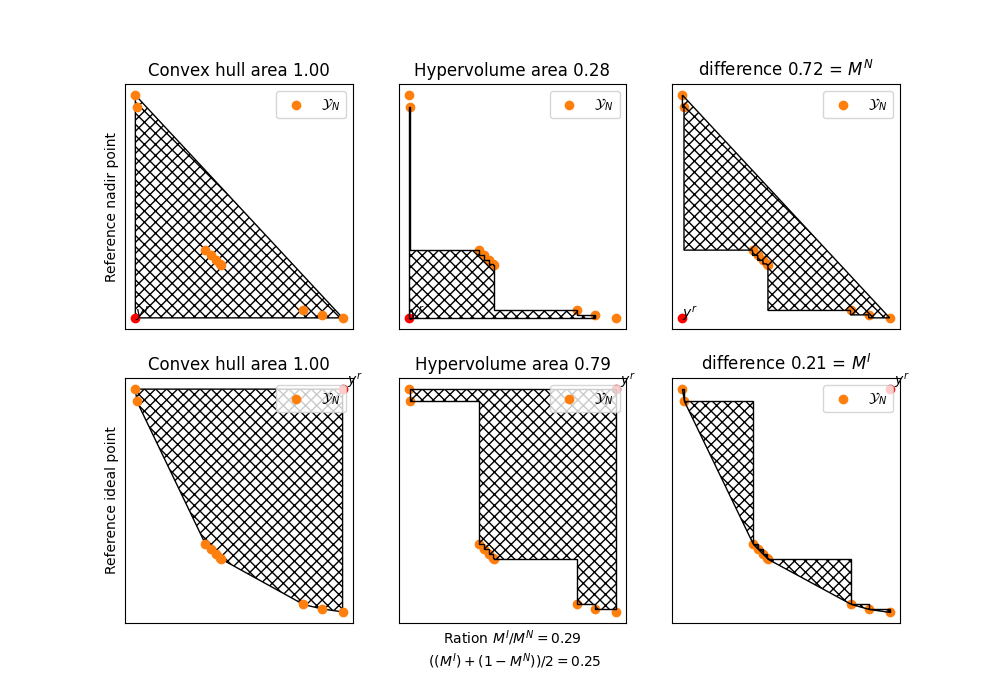
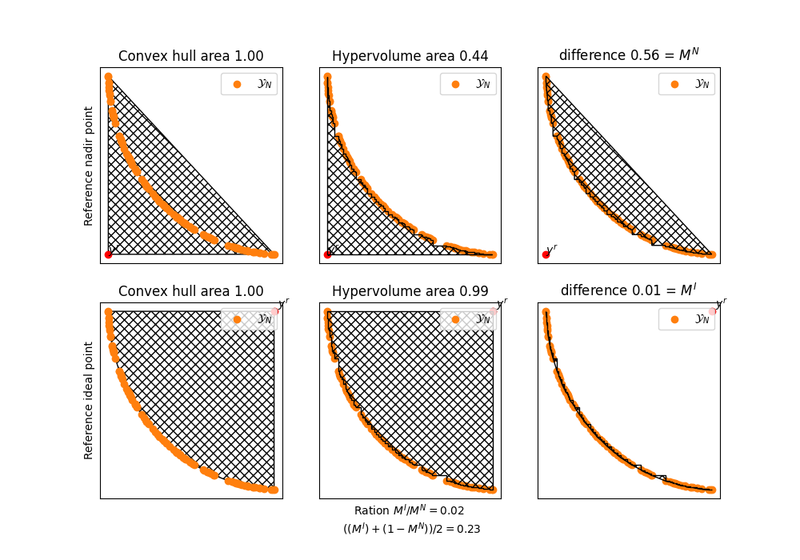
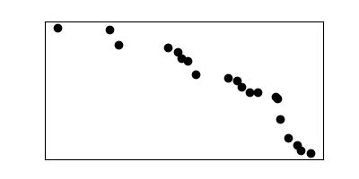
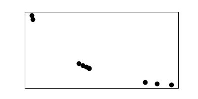
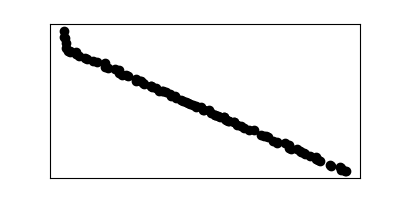
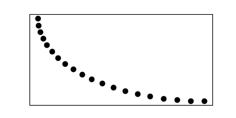

# Pareto Front convexity measure

NOTE: We consider bi-objective maximization problems.

Given a discrete Pareto Front $\mathcal{Y}_N \subset \mathbb{R}^2$ we define two polygons $P^I$ and $P^N$ using the reference points $y^I$ (ideal point) and $y^N$ (Nadir point) as follows:
- $P^I = \bigcup_{y \in \mathcal{Y}_N} Box(y, y^I)$
- $P^N = \bigcup_{y \in \mathcal{Y}_N} Box(y^N, y)$

We define the convexity measures: $M^I$ as the area of $P^I$ divided by the area of $conv(M^I)$ and $M^N$ as the area of $M^N$ divided by the area of $conv(M^N)$.
$M^N$ small implies convexity $\Leftrightarrow$ $M^N$ large implies concavity. $M^I$ small implies concavity $\Leftrightarrow$ $M^I$ large implies convexity. Ratio M^I/M^N.

We combine these to a single measure $M = \frac{M^I + (1-M^N)}{2}$ where $1$ indicates convexity and $0$ indicates concavity.

## Ideas for combined measure.

The above measure $M$ would only be $1$ if the ideal point is in the Pareto front.

One could compare the area $conv(Y_N)$ with the area of $envelope(Y_N)$.

# Usage

Download the the project and create a new python enviroment with `python3 -m venv .venvname`. In the activated shell run `pip install -r requirements.txt` installing the dependencies `matplotlib, numpy` and `shapely`. The library `shapely` is used for operations on polygons (works only for $p=2$ dimensions).

Sets of points are represented with the `PointList` class from the file `classes.pointclass`. This class has a lot of methods where only a few are used such as `.get_supported()`.

A pointset is defined by an iterable of vectors. e.g. `Y = PointList([(1,2),(3,2),(4,2)])`.

See the file `main.py` on how to call the Pareto Measure. To get the measure $M \in (0,1)$ use the function `M = convexity_measure(Y,  figname = figname) # with plots saved as figname (slower)` the figname should end with `.png` or `.pdf`.

# Some plots

# Result Table

<table style="width:400px;background-color">
<tr><th>Y</th><th>1-M^n</th><td> M </th></tr>
<!---RESULT_TABLE-->

<tr><td></td><td>0.96</td><td>0.74</td></tr>
<tr><td></td><td>0.92</td><td>0.66</td></tr>
<tr><td></td><td>0.28</td><td>0.25</td></tr>
<tr><td></td><td>0.44</td><td>0.23</td></tr>
<tr><td></td><td>0.99</td><td>0.79</td></tr>
<tr><td></td><td>0.86</td><td>0.44</td></tr>
<tr><td></td><td>0.95</td><td>0.50</td></tr>
<tr><td></td><td>0.83</td><td>0.47</td></tr>
<tr><td></td><td>0.89</td><td>0.53</td></tr>
<tr><td></td><td>0.97</td><td>0.79</td></tr>
<tr><td></td><td>0.39</td><td>0.21</td></tr></table>